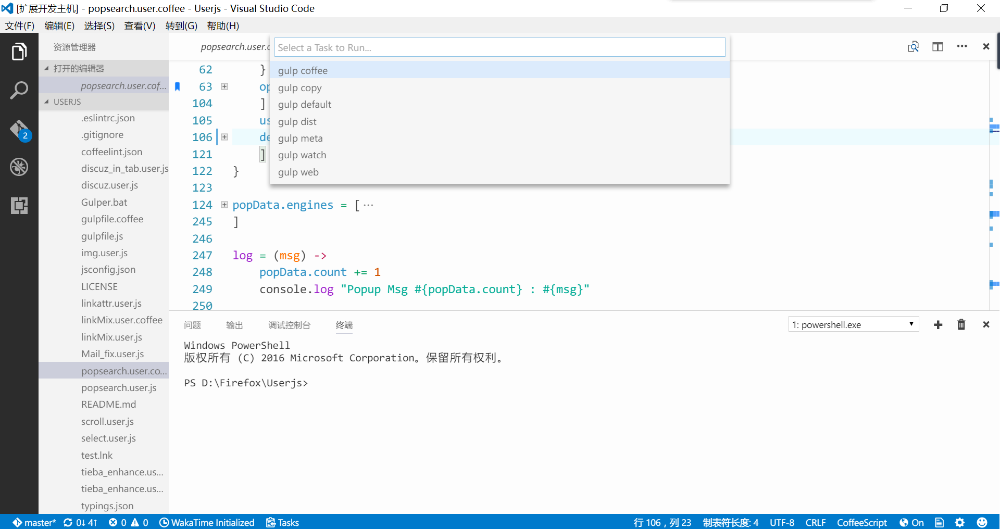
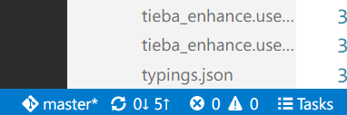

# Quick Task for VS Code

> Based on [Task Master](https://marketplace.visualstudio.com/items?itemName=ianhoney.task-master)

Quick Task will automatically trawl your project directory for task scripts,
e.g. npm, gulp, shell, bat, python, ruby, powershell, perl scripts etc...
and allow you to execute each task with the click of a mouse!

As shown bellow, all tasks will showup after click the task button on statusbar and you can
execute any item simply by clicking it.

Highlights:
- Auto rescan after task files changed / added / deleted.
- Allow you to close terminal window automatically after execution.

Hint: Task button is usually here:

Support Tasks:
- NPM Tasks.
- Gulp Tasks.
- Shell Scripts.
- Python Scripts.
- Ruby Scripts.
- Perl Scripts.
- Vbs Scripts.
- AutoHotKey Scripts.
- batch file and Powershell Scripts.

>Install [Quick Task](https://marketplace.visualstudio.com/items?itemName=lkytal.quicktask) via vs market

## My Other extensions:

### [FlatUI](https://marketplace.visualstudio.com/items?itemName=lkytal.FlatUI)
### [Pomodoro](https://marketplace.visualstudio.com/items?itemName=lkytal.pomodoro)
### [Coffee Lint](https://marketplace.visualstudio.com/items?itemName=lkytal.coffeelinter)
### [Translator Plus](https://marketplace.visualstudio.com/items?itemName=lkytal.translatorplus)

## Release Notes

## [2.4.0] - 2017-03-18
### Added
- Option to use yarn instead of npm.

## [2.3.1] - 2017-03-18
### Fixed
- Script file can now execute correctly.

## [2.3.0] - 2017-03-17
### Added
- Ability to scan for VSCode tasks (those in tasks.json).

### Fixed
- Batch file config item.

## [2.2.2] - 2017-03-13
### Fixed
- Tiny fixes.

## [2.2.0] - 2017-03-07
### Added
- "defaultTask" option to add your own default tasks.

## [2.1.3] - 2017-03-02
### Changed
- Seperate rescan process of npm and gulp.

## [2.1.2] - 2017-02-28
### Changed
- ".vbs" and ".ahk" included.

### Fixed
- Other duplicated items.

## [2.1.1] - 2017-02-24
### Changed
- Show error message when task loading failed.
- ".Cmd" included.

### Fixed
- Duplicated items.

## [2.1.0] - 2017-02-22
### Changed
- Instant reaction towards task changes.

## [2.0.1] - 2017-02-21
### Changed
- Better performance during rescanning.

### Fixed
- Execute batch files and shellscripts correctly.

## [2.0.0] - 2017-02-18
### Added
- Option to watch for task changes.

## [1.2.0] - 2017-02-18
### Added
- Option to close terminal after execution finished. (experimental)

## [1.1.0] - 2017-02-16
### Added
- Option to control show terminal or not.

### Fixed
- Task scanning loop.

## [1.0.0] - 2017-02-16
- First release.

> 
Icons made by <a href="http://www.flaticon.com/authors/vectors-market" title="Vectors Market">Vectors Market</a> from <a href="http://www.flaticon.com" title="Flaticon">www.flaticon.com</a> is licensed by <a href="http://creativecommons.org/licenses/by/3.0/" title="Creative Commons BY 3.0" target="_blank">CC 3.0 BY</a>

